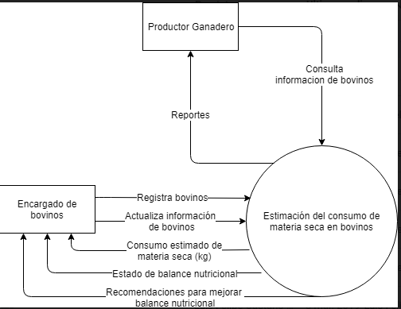
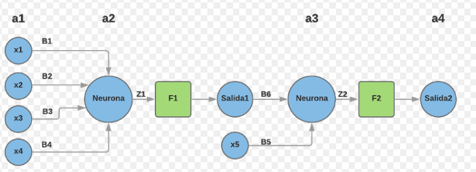

# Prototipo funcional de una red neuronal para la predicción de ingesta de materia seca y balance nutricional en vacas Holstein

Actualmente existe un modelo matemático de origen estadounidense que permite calcular el CMS en bovinos de raza Holstein, este modelo fue desarrollado con datos colectados en regiones con condiciones climáticas templadas, con animales manejados en estabulación y consumiendo alimentos acordes a este ecosistema, utilizando variables tales como  peso vivo del bovino, semanas en lactancia, porcentaje de grasa en leche y producción de leche lo que ocasiona que al ser utilizado en trópicos, las variaciones principalmente climatológicas generen afectaciones en la relación tipo-calidad del pasto y del concentrado que consume el bovino provocando inconsistencias en el resultado esperado.

>CMS (kg/d) =0.372 x PLC+0.0968 x P0.751 -e(-0.192(SL+3.67))

Dónde CMS = Consumo Materia Seca, PLC = Producción de leche corregida al 4% (kg/d), P = Peso (kg), SL = Semana de lactancia. y FIR = Factor de ingesta relativo

Para el productor es importante conocer el consumo de materia seca porque:

1. La ingestión de nutrientes
2. El nivel de producción (carne, leche, trabajo)
3. Establecer planes de alimentación acordes con los requerimientos del animal

Buscamos implementar el modelo de predicción desde un aplicativo móvil que basado en una red neuronal que esté entrenada con información acorde a las condiciones del territorio, le permita estimar, almacenar y acompañar el consumo de materia seca de los animales en tiempo real. Esto le permitirá tomar decisiones acertadas sobre el manejo nutricional del rebaño, mejorando la eficiencia de utilización de los recursos y aumentando su margen de rentabilidad.

## Para para el cálculo del consumo de materia seca

### Producción de leche

Sustancia líquida y blanca que segregan las mamas de las hembras de los mamíferos para alimentar a sus crías y que está constituida por caseína, lactosa, sales inorgánicas, glóbulos de grasa suspendidos y otras sustancias; especialmente la que producen las vacas, que sirve como alimento y de la cual se obtiene, además, queso, yogur, mantequilla y otros derivados. La producción de leche se mide en litros/día o Kg/día.

### Producción de leche corregida al 4% de grasa (PLC)

 Las hembras vacunas producen leche con diferentes porcentajes de grasa. La diferencia en composición de la leche entre animales de la misma raza, hace con que no sea posible comparar el desempeño productivo de los animales solo con base en el volumen de producción.   Dos vacas pueden producir el mismo volumen de leche (20 litros) pero una la produce con 3% de grasa y la otra con 4%, sería injusto decir que la producción es la misma cuando la leche con 4% de grasa es más nutritiva. Para efectuar la corrección al 4% de grasa se emplea la siguiente expresión matemática:

PLC = 15* (litros de leche producidos * % de grasa) +0.4*(litros de leche producidos)

### Peso vivo

Fuerza que la gravedad ejerce sobre una masa en este caso sobre el bovino, el peso se mide en Kg.

### Semana de lactancia

 Semanas que han transcurrido desde el inicio de la producción de leche

### Porcentaje de grasa en leche

 Contenido de lípidos en la leche, el método para su medición es el Gerber.

## Para el balance nutricional

### Energía bruta

Es la energía que se obtendría al quemar un alimento en una bomba calorimétrica. Se mide en Kcal (kilocalorías) y se puede calcular a partir de la composición del alimento respecto a sus proporciones de lípidos (grasas), proteínas e hidratos de carbonos.

### Ingreso de materia seca

 Cantidad medida en kilos de alimento seco que la vaca lechera ingiere en su organismo.

### Ingreso de concentrado

 Cantidad medida en kilos de cuido que la vaca lechera ingiere en su organismo.

### Egreso de alimentos (Energía digestiva)

Cantidad de energía expulsada del cuerpo del bovino por medio de las heces.

## Diagrama de contexto

## Diseño red neuronal

