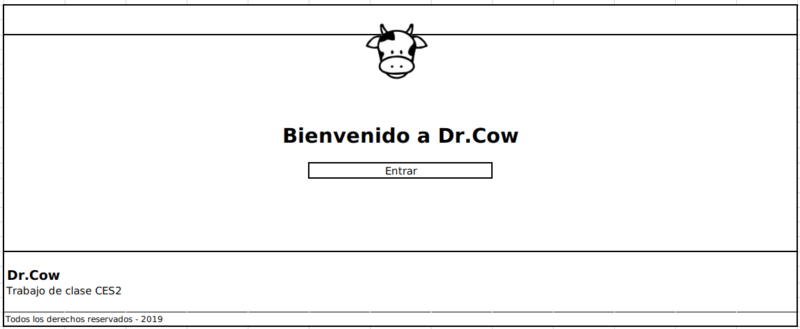
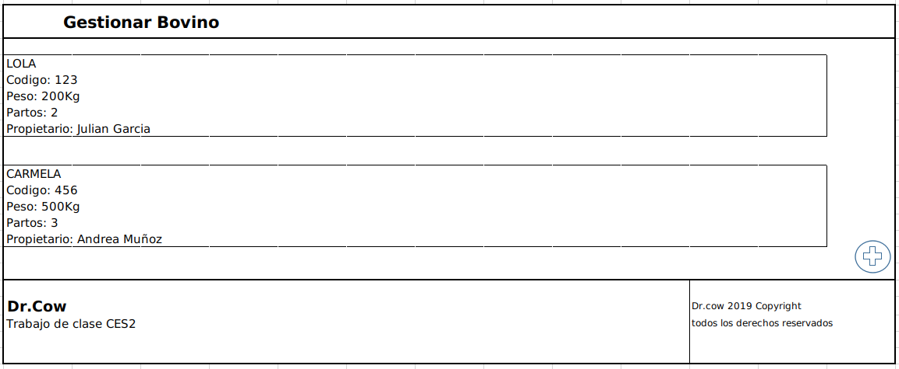
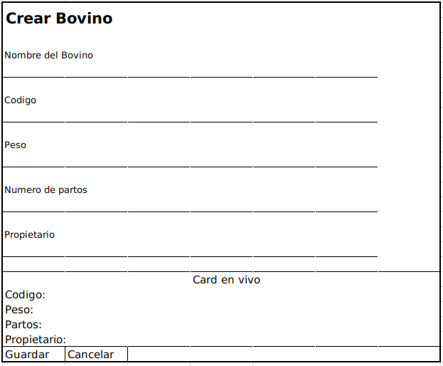
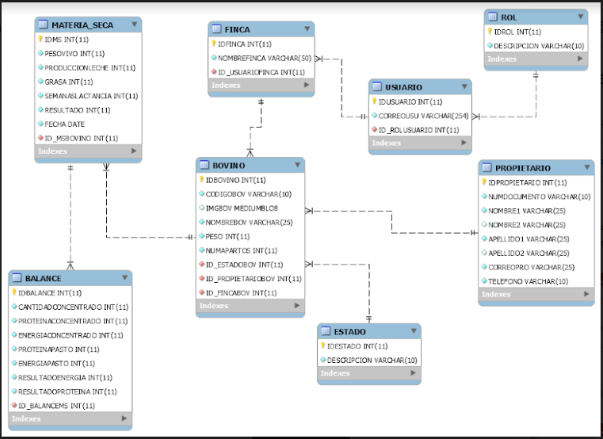
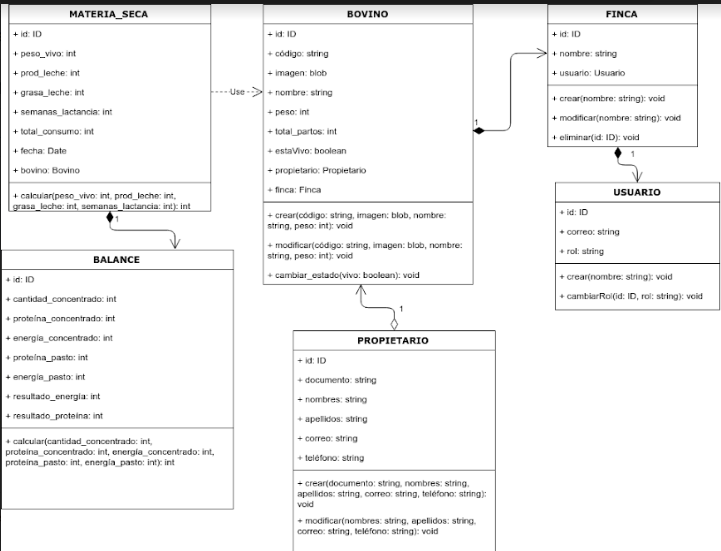

# Prototipo funcional de una red neuronal para la predicción de ingesta de materia seca y balance nutricional en vacas Holstein

## Enlace del LandingPage y aplicacion navegable en Netlify

> https://drcow.netlify.com/

## Modelo Wireframe o Prototipos

## Modelo Entidad-Relacion

### Diccionario de datos del modelo E-R

Entidades:

1. Bovino
- PK idbovino
- codigo
- imagen
- nombre
- peso
- numero de partos
- FK Estado - traida de entidad estado
- FK Propietario - traida de la entidad propietario
- FK Finca - traida de la entidad finca

2. Finca
- PK idfinca
- nombre finca
- FK usuario - traida de la entidad usuario

3. Usuario
- PK idusuario
- correo usuario
- FK Rol - traida de la entidad rol

4. Rol
- PK idrol
- descripcion

5. Propietario
- PK idpropietario
- nombres 1 y 2
- apellidos 1 y 2
- correo
- telefono

6. Estado
- PK idestado
- descripcion

7. Materia seca
- PK idms
- pesovivo
- produccion leche
- grasa
- semanas lactancia
- resultado
- fecha
- FK Bovino - traida de la entidad bovino

8. Balance
- PK idbalance
- cantidad concentrado
- proteina concentrado
- energia concentrado
- proteina pasto
- energia pasto
- resultado energia general
- resultado proteina general
- FK Materia seca - traida de la entidad materia seca

## Diagrama de clases

### Funcionalidades de cada clase

Operaciones:

1. Clase Bovino
- Crear (string codigo, blob imagen, string nombre, int peso): no retorna
- Modificar (string codigo, blob imagen, string nombre, int peso): no retorna
- cambiar estado (boolean estado): no retorna

2. Clase Propietario
- Crear (string documento, string nombres, string apellidos, string correo, string telefono): no retorna
- Modificar (string nombres, string apellidos, string correo, string telefono): no retorna

3. Clase Finca
- Crear (string nombre): no retorna
- Modificar (string nombre): no retorna
- Eliminar (int id): no retorna

4. Clase Usuario
- Crear (string nombre): no retorna
- CambiarRol (int id, string rol): no retorna

5. Clase Materia Seca
- Calcular (int pesovivo, int prodleche, int grasa, int semanaslactancia): retorna un int

6. Clase Balance Nutricional
-  Calcular (int cantidad concentrado, int proteinaconcentrado, int energiaconcentrado, int proteinapasto, int energiapasto): retorna un int
